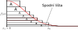

# Custom RNG implementation using Zikkurat method in MATLAB 

The ziggurat algorithm is an algorithm for pseudo-random number sampling. Belonging to the class of rejection sampling algorithms, it relies on an underlying source of uniformly-distributed random numbers, typically from a pseudo-random number generator, as well as precomputed tables. The algorithm is used to generate values from a monotonically decreasing probability distribution. In this project, we extended this idea to an arbitrary probability distribution, with a demonstration on an example of Generalized Inversed Gaussian distributin (GIG)
$$f(x) = \frac{(\frac{a}{b})^{p/2}}{2 \mathcal{K}_p(\sqrt{ab})} \Theta(x) x^{p-1} \mathrm{exp}\left(-\frac{ax +\frac{b}{x}}{2}\right),$$

where $\Theta(x)$ is the Heaviside step function, $\mathcal{K}_p$ is the modified Bessel function of the second kind, and for the parameters $a,b>0, , p \in \mathbb{R}$.

The final report is in ```english-version.pdf```. 




## Table of Contents
- [GAUSS](#gauss)
- [GIG](#gig)
- [Images](#images)

## GAUSS

Contains MATLAB scripts for the Zikkurat algorithm (rejection rules, statistical checks, fallback, etc.) implementation in the case of the Normal (Gaussian) distribution.

## GIG

Contains MATLAB scripts for the Zikkurat algorithm (rejection rules, statistical checks, fallback, etc.) implementation in the case of the GIG distribution.

## Images

All the generated images are saved in the directory ```images```. It is usually not a good practice to upload images to github.
